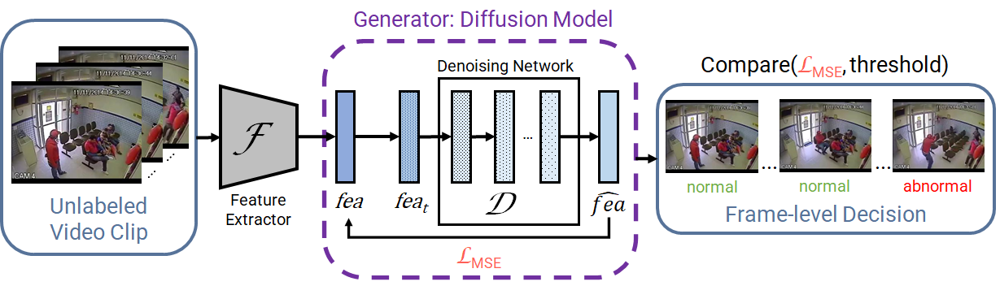

# [ICIP 2023] Exploring Diffusion Models For Unsupervised Video Anomaly Detection




> [**Exploring Diffusion Models For Unsupervised Video Anomaly Detection**](https://arxiv.org/abs/2304.05841)<br>
> [Anil Osman Tur](https://scholar.google.com/citations?user=W4yNf8UAAAAJ), [Nicola Dall'Asen](https://scholar.google.com/citations?user=e7lgiYYAAAAJ), [Cigdem Beyan](https://scholar.google.com/citations?user=VmjUxckAAAAJ), [Elisa Ricci](https://scholar.google.com/citations?user=xf1T870AAAAJ)<br>
> University of Trento, Fondazione Bruno Kessler, Trento, Italy, <br>

DOI: [10.1109/ICIP49359.2023.10222594](https://doi.org/10.1109/ICIP49359.2023.10222594)

## Installation

Please follow the instructions in [INSTALL.md](docs/INSTALL.md).

## Dataset and Data Preparation

Please follow the instructions in [DATASET.md](docs/DATASET.md) for data preparation.


## Diffusion Model

Implemented diffusion model is in the k_diffusion/models/feature_v1.py file. The model is trained with train_ano.py script.


## Autoencoder Model

The autoencoder model is re-implemented from the descriptions of the paper [Generative Cooperative Learning for Unsupervised Video Anomaly Detection](https://openaccess.thecvf.com/content/CVPR2022/html/Zaheer_Generative_Cooperative_Learning_for_Unsupervised_Video_Anomaly_Detection_CVPR_2022_paper.html). Used for generating the baselines for the paper.


 


## Citation:

Please use the following BibTeX entry for citation.

```latex

@INPROCEEDINGS{tur2023exploring,
  author={Tur, Anil Osman and Dall’Asen, Nicola and Beyan, Cigdem and Ricci, Elisa},
  booktitle={2023 IEEE International Conference on Image Processing (ICIP)}, 
  title={Exploring Diffusion Models for Unsupervised Video Anomaly Detection}, 
  year={2023},
  volume={},
  number={},
  pages={2540-2544},
  doi={10.1109/ICIP49359.2023.10222594}}

```
